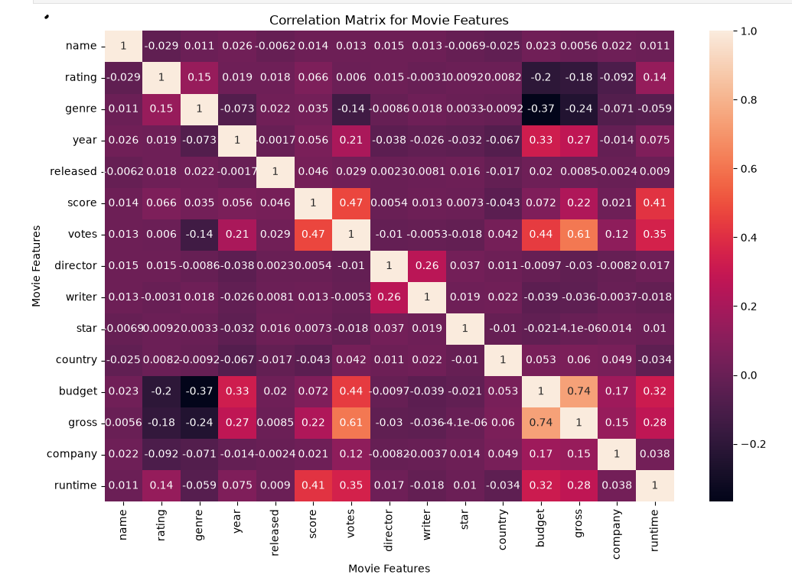

# Movie Industry Correlation Analysis

## Project Overview

This project analyzes movie industry data to identify the factors most strongly associated with gross earnings.

The analysis was performed in Python using Jupyter Notebook.

## Tools & Libraries

- Python
- Jupyter Notebook
- Pandas
- NumPy
- Matplotlib
- Seaborn

## Analysis Performed

- Data Cleaning
- Missing Value Handling
- Duplicate Detection
- Exploratory Data Analysis (EDA)
- Budget vs Gross Earnings Visualization
- Correlation Analysis
- Correlation Heatmaps
- Numerical and Categorical Feature Analysis

- ## Correlation Heatmap

The correlation analysis highlights the relationships between movie features, with budget and audience votes showing the strongest positive associations with gross earnings.

## Project Structure

- `Movie_Correlation_Project.ipynb` — Complete Python analysis and visualizations
- `movies.csv` — Movie industry dataset used for analysis
- `correlation_heatmap.png` — Full correlation matrix visualization
- `README.md` — Project documentation

## Key Findings

- **Budget vs Gross: 0.74** — Strong positive correlation, indicating that higher-budget movies tend to generate higher gross earnings.
- **Votes vs Gross: 0.61** — Moderately strong positive correlation, suggesting that movies with greater audience engagement tend to earn more.
- Budget showed the **strongest association with gross earnings** among the numerical variables analyzed.
- Score, runtime, and year showed comparatively weaker relationships with gross earnings.
- 
## Conclusion

The analysis indicates that **movie budget and audience engagement (votes)** are the variables most strongly associated with gross earnings in this dataset.

While these relationships are significant, correlation represents association and does not necessarily imply causation.
